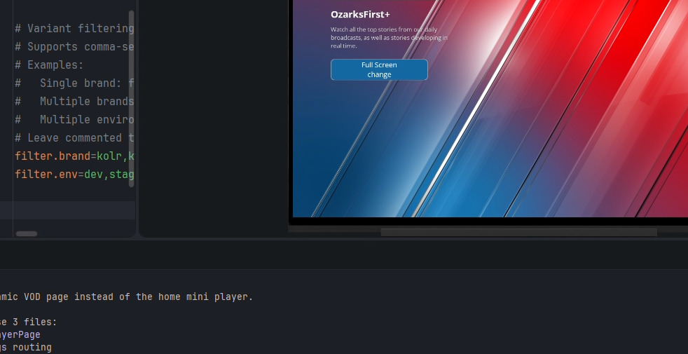

# Claude Screenshot MCP

A screen capture plugin for [Claude Code](https://docs.claude.com/en/docs/claude-code) that fixes the broken clipboard-to-prompt image workflow.

**The problem:** On Windows, the Snipping Tool copies images to the clipboard, but pasting them into Claude Code no longer works. You're forced to save the file manually, copy the path, and paste it. Terrible UX.

**The solution:** Press a hotkey, drag to select a region, and the screenshot file path is instantly on your clipboard -- ready to paste into Claude Code.



---

## Features

- **Global hotkey** (default `Ctrl+Shift+Q`) triggers a screen region selector
- **Recapture hotkey** (default `Ctrl+Alt+Q`) instantly re-captures the last selected region -- no overlay, no interaction
- **Click and drag** to select any area -- the file path is copied to your clipboard
- **ESC or right-click** to cancel at any time
- **Configurable** hotkeys, save directory, image format, overlay appearance
- **MCP integration** -- Claude Code can also trigger captures directly via tools
- **Cross-platform** -- Windows, macOS, Linux
- **No overlay in screenshots** -- the screen is captured before the overlay appears

---

## Quick Install

### Windows

```powershell
git clone https://github.com/raphaelbgr/claude-screenshot-mcp.git
cd claude-screenshot-mcp
powershell -ExecutionPolicy Bypass -File install.ps1
```

### macOS / Linux

```bash
git clone https://github.com/raphaelbgr/claude-screenshot-mcp.git
cd claude-screenshot-mcp
chmod +x install.sh && ./install.sh
```

### Manual Install

```bash
pip install -e ".[all]"
claude mcp add screenshot-mcp -- python -m screenshot_mcp
```

The installer checks all prerequisites (Python 3.10+, pip, tkinter, Claude Code) and tells you exactly what's missing before installing.

---

## Usage

### 1. Start the hotkey daemon

```bash
claude-screenshot-daemon
```

You'll see:

```
  Claude Screenshot Daemon
  ========================
  Capture hotkey:    ctrl+shift+q
  Recapture hotkey:  ctrl+alt+q
  Status:  Listening...

  Press the capture hotkey to select a screen region.
  Press the recapture hotkey to re-capture the last region.
  Press ESC during capture to cancel.
  Right-click during capture to cancel.
  The file path will be copied to your clipboard.
  Press Ctrl+C to stop the daemon.
```

### 2. Press the hotkey

A dark overlay appears with a crosshair cursor. Click and drag to select a region.

### 3. Paste into Claude Code

The screenshot file path is automatically copied to your clipboard. Press `Ctrl+V` in Claude Code to paste it.

---

## Configuration

### Change the hotkey

```bash
# For this session only:
claude-screenshot-daemon --hotkey ctrl+alt+p

# Save as new default:
claude-screenshot-daemon --set-hotkey ctrl+alt+p
```

### Debug mode

If the hotkey isn't working, use debug mode to see what keys are being detected:

```bash
claude-screenshot-daemon --debug
```

### Config file

Settings are stored in a JSON file:

| OS | Path |
|----|------|
| Windows | `%APPDATA%\claude-screenshot-mcp\config.json` |
| macOS | `~/Library/Application Support/claude-screenshot-mcp/config.json` |
| Linux | `~/.config/claude-screenshot-mcp/config.json` |

### All settings

| Key | Default | Description |
|-----|---------|-------------|
| `hotkey` | `ctrl+shift+q` | Capture hotkey combination |
| `recapture_hotkey` | `ctrl+alt+q` | Recapture last region hotkey |
| `save_directory` | System temp folder | Where screenshots are saved |
| `image_format` | `png` | Image format (`png`, `jpg`, `webp`) |
| `copy_path_to_clipboard` | `true` | Auto-copy file path to clipboard |
| `show_notification` | `true` | Show system notification after capture |
| `overlay_color` | `#00aaff` | Selection rectangle color |
| `overlay_opacity` | `0.3` | Overlay transparency (0.0 - 1.0) |

---

## MCP Tools (for Claude Code)

When registered as an MCP server, Claude Code gets these tools:

| Tool | Description |
|------|-------------|
| `screenshot_capture_region` | Interactive region selector -- click and drag to capture |
| `screenshot_recapture_region` | Re-capture the last selected region instantly (no overlay). If no previous region exists, falls back to the interactive selector automatically |
| `screenshot_capture_fullscreen` | Capture the entire screen (all monitors) |
| `screenshot_capture_coordinates` | Capture a specific region by x, y, width, height |
| `screenshot_get_latest` | Get paths to the most recent screenshots |
| `screenshot_get_config` | View current plugin configuration |
| `screenshot_update_config` | Update a configuration setting |

The `screenshot_recapture_region` tool is especially useful for LLMs that need to monitor the same screen area repeatedly (e.g., watching a build log, checking a UI change, or verifying terminal output). Call it once to select the area interactively, then call it again to instantly re-capture the same coordinates -- no user interaction needed.

In Claude Code, just ask naturally:
- "Take a screenshot of a region on my screen"
- "Recapture the same region again"
- "Keep checking that area of the screen"
- "Capture my full screen"
- "Show me my latest screenshots"
- "Change my screenshot hotkey to ctrl+alt+p"

---

## How It Works

1. **Pre-capture**: The full screen is captured *before* the overlay appears, so the overlay never shows in screenshots
2. **Overlay**: A transparent fullscreen `tkinter` window with crosshair cursor appears
3. **Selection**: Click and drag to draw a blue selection rectangle
4. **Crop & save**: The pre-captured image is cropped to the selected region and saved
5. **Clipboard**: The file path is copied to clipboard via native OS commands

The daemon uses `pynput` for global hotkey detection, with key normalization that handles left/right modifier variants and control character remapping (e.g., `Ctrl+S` sends `\x13` on Windows, which is correctly resolved to `s` via virtual key codes).

---

## Requirements

| Requirement | Version | Notes |
|-------------|---------|-------|
| Python | 3.10+ | |
| pip | any | |
| tkinter | any | Usually included with Python on Windows |
| pynput | 1.7.6+ | For hotkey daemon (installed automatically) |
| mss | 9.0+ | Screen capture (installed automatically) |
| Pillow | 10.0+ | Image processing (installed automatically) |
| Claude Code | any | Optional, for MCP integration |

### Platform notes

- **Windows**: Works out of the box. Python installer includes tkinter by default.
- **macOS**: May need `brew install python-tk` for tkinter.
- **Linux**: May need `sudo apt install python3-tk xclip` for tkinter and clipboard.

---

## Troubleshooting

### Hotkey not working

Run with `--debug` to see if keys are being detected:

```bash
claude-screenshot-daemon --debug
```

Press your hotkey and check that all keys show up as normalized names (e.g., `ctrl`, `shift`, `s`). If the key names don't match what you expect, try a different hotkey.

### Overlay doesn't appear

Make sure tkinter is installed:

```bash
python -c "import tkinter; print('OK')"
```

### Permission errors on install

If `pip install` fails with permission errors, try:

```bash
pip install --user -e ".[all]"
```

### `claude-screenshot-daemon` not found after install

The script may not be on your PATH. Use the module directly:

```bash
python -m screenshot_mcp.daemon
```

### Screenshots are black

This can happen if screen capture is blocked by your OS. On macOS, grant screen recording permission in System Preferences > Privacy > Screen Recording.

---

## Project Structure

```
claude-screenshot-mcp/
  screenshot_mcp/
    __init__.py        # Package metadata
    __main__.py        # python -m screenshot_mcp entry point
    capture.py         # Screen capture + region selector overlay
    config.py          # Configuration management
    daemon.py          # Hotkey listener daemon
    server.py          # MCP server with tools
  pyproject.toml       # Package configuration
  install.ps1          # Windows installer (PowerShell)
  install.sh           # macOS/Linux installer (Bash)
  README.md
  LICENSE
```

---

## License

MIT
